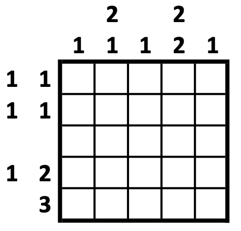
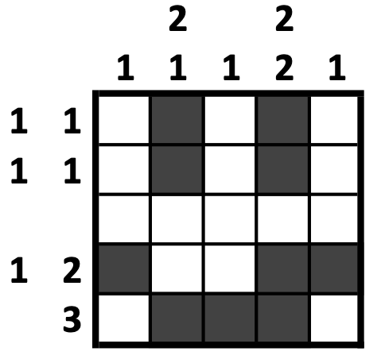

# NonogramSolver.jl

[](https://kamilkhanlab.github.io/NonogramSolver.jl/stable/)
[](https://kamilkhanlab.github.io/NonogramSolver.jl/dev/)
[](https://github.com/kamilkhanlab/NonogramSolver.jl/actions/workflows/CI.yml?query=branch%3Amain)
[](https://codecov.io/gh/kamilkhanlab/NonogramSolver.jl)

This package provides a Julia module for formulating [nonogram
puzzles](https://en.wikipedia.org/wiki/Nonogram) (a.k.a. Picross,
paint-by-number, and crucipixel), and for solving these puzzles using
integer linear programming (ILP) via
[JuMP](https://jump.dev/JuMP.jl/stable/). A [new effective ILP
formulation](https://doi.org/10.1109/TG.2020.3036687) by Khan is
employed. 

Monochrome and multicolored puzzles are both supported. If a
puzzle has multiple solutions, then only one will be identified. If a
puzzle has no solutions, then this will be identified, and a fake solution will be returned with no cells colored.

A simple example is included below; for further information and API details, please see the package's documentation linked above.

If you make use of this implementation in your own work, please cite
the accompanying article:

> Kamil A. Khan, Solving nonograms using integer programming without
> coloring, *IEEE Transactions on Games*, 14(1): 56-63, 2022.
> doi:[10.1109/TG.2020.3036687](https://doi.org/10.1109/TG.2020.3036687)

### See also:

- our [corresponding implementation in GAMS](https://github.com/kamilkhanlab/nonogram-ilp);
- an [implementation by
  Kalvelgen](http://www.amsterdamoptimization.com/benchmarkmodels.html)
  in GAMS of a previous approach by Bosch;
- and [Web Paint-by-Number](https://webpbn.com), a library of user-designed
  puzzles. Our package supports puzzles that are [exported in `.cwc` format](https://webpbn.com/export.cgi) from Web Paint-by-Number.

## Puzzle overview

The goal of this puzzle is to color certain cells in a rectangular grid,
in a manner that is consistent with clues pertaining to each row and each column. Each
row's clues include a number for each block of contiguous colored
cells in that row. The numerical value in this clue indicates how many cells
are in the corresponding contiguous block. Columns' clues are analogous.

For example, the following puzzle instance:



has the unique solution:



While "real-world" instances are often deliberately designed to be
solvable by hand, this puzzle in general is NP-complete.

## Installation

This package may be installed via Julia's standard package
installation procedure. In the Julia REPL, enter the command:

```julia
import Pkg; Pkg.add("NonogramSolver")
```

## Example

With the package installed, we may solve the above example problem as
follows in Julia. For more details, refer to the API documentation.

1. Load the package's module:

   ```julia
   using NonogramSolver
   ```

2. Enter the row clues as a `Vector{Vector{Int}}`, and the column
   clues similarly. Note that an uncolored row (or column), with no
   numerical clues at all, is entered as `Int[]`:
   
   ```julia
   rowClues = [[1,1], [1,1], Int[], [1,2], [3]]
   colClues = [[1], [2,1], [1], [2,2], [1]]
   ```

3. Construct a `Puzzle` object to hold the puzzle's formulation:

	```julia
	puzzle = Puzzle(rowClues, colClues)
	```

4. Use JuMP to solve this puzzle as an integer linear program, using
   the freely available solver GLPK by default.
   
   ```julia
   puzzleSolution = solve_puzzle(puzzle; verbosity=0)
   ```
   
   You can customize the
   choice of solver and its options. Without `verbosity=0`, JuMP's
   solution summary is printed.

5. If the previous step was carried out in Julia's REPL, then the
   solution has already been displayed. Otherwise, retrieve the
   solution in one of three ways:
   
   - displayed to the REPL/terminal, via: 

	 ```julia
	 @show puzzleSolution`
	 ```
		
   - as a `String` containing the solution as a grid of colored-square
     emojis, with:
	 
	 ```julia
	 stringOutput = repr(puzzleSolution)
	 ```
 
   - as a `Matrix` of `0`s and `1`s, with:
   
     ```julia
	 matrixOutput = puzzleSolution.z
	 ```
