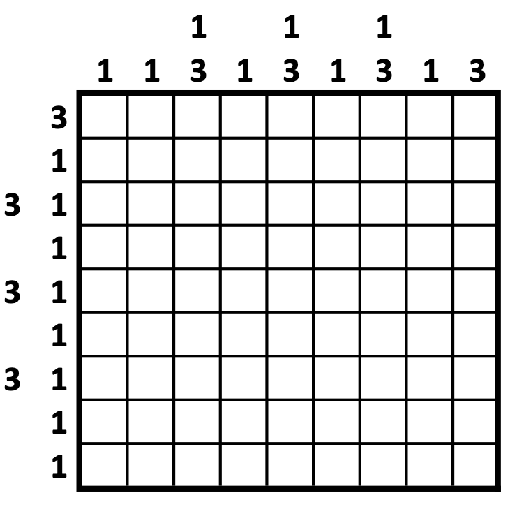

```@meta
CurrentModule = NonogramSolver
```

# NonogramSolver.jl

## Overview

This package provides a Julia module for formulating [nonogram
puzzles](https://en.wikipedia.org/wiki/Nonogram) (a.k.a. Picross,
paint-by-number, and crucipixel), and for solving these puzzles using
integer linear programming (ILP) via
[JuMP](https://jump.dev/JuMP.jl/stable/). A [new effective ILP
formulation](https://doi.org/10.1109/TG.2020.3036687) by Khan is
employed. Monochrome and multicolored puzzles are both supported.

If you make use of this implementation in your own work, please cite
the accompanying article:

> Kamil A. Khan, Solving nonograms using integer programming without
> coloring, *IEEE Transactions on Games*, 14(1): 56-63, 2022.
> doi:[10.1109/TG.2020.3036687](https://doi.org/10.1109/TG.2020.3036687)

This solution approach has also been [implemented in
GAMS](https://github.com/kamilkhanlab/nonogram-ilp).

## Puzzle description

The following figure depicts a simple instance of a monochrome puzzle 
(left) and its unique solution (right).

```@raw html
<table border="0"><tr>
<td>
	<figure>
		
	</figure>
</td>
<td>
	<figure>
		
	</figure>
</td>
</tr></table>
```

The goal of this puzzle is to color each cell in the grid either
filled/black or unfilled/white, consistently with both
the *row clues* to the left and the *column clues* above the puzzle. Each clue
number indicates a series of contiguous black cells in that
row/column, in the specified order. For example, the row clues for the 4th row (`"1 2"`)
indicate that the 4th row of the solved puzzle must contain the
following, from left to right:

- any number of white cells,
- then 1 black cell,
- then at least 1 white cell,
- then 2 black cells,
- then any number of white cells.

The column clues are analogous, and describe the column's contents
from top to bottom. The "empty" clue for the 3rd row
indicates that this row must contain no black cells at all.

Simple puzzles may be solved by *line solving*, which involves
deducing as much as possible about the cells in a single row (or
column) using only that row's numerical clues, along with any known
colors of that row's cells. "Real-world" instances are often deliberately designed so
that line solving is particularly effective.

However, in general this problem is NP-complete, and line solving may be
completely useless, such as in the following example adapted from
[Greifer and Wolter](https://webpbn.com/survey/dom.html):

```@raw html
<figure>
	
</figure>
```
This puzzle instance has a unique solution (and we find it below), but it
cannot be approached by line solving at all.

In multicolored puzzles, the contiguous filled blocks in each
row/column may instead have colors other than black. Thus, each clue
number is colored with the color of the corresponding
block. Successive blocks of different colors need not be separated by
at least one white cell. Intuitively, multicolored puzzles are easier
than analogous monochrome puzzles, because there are fewer "red
herring" candidate solutions to eliminate.

## Method overview

A [solution approach by Khan](https://doi.org/10.1109/TG.2020.3036687)
formulates the puzzle as an integer linear program (ILP). Unlike
previous approaches, this ILP formulation does not refer directly to
individual cells' colors, and doesn't proceed by coloring the cells
one by one. In numerical experiments, this approach outperforms previous ILP-based approaches.

The ILP is a constraint satisfaction problem with three types of
constraints:

- for each row (or column), enforcing that each colored block in this row (or column) begins once,
- for each row (or column), enforcing that the blocks in this row (or column) occur in the
  specified order and don't overlap, and
- for each cell, ensuring that this cell is colored consistently with its row's clues and
  its column's clues.

## Installation

Install the package with the following command in Julia's REPL:
```julia
import Pkg; Pkg.add("NonogramSolver")
```

## Examples

Suppose we wish to solve the above puzzles in Julia, and the package
is already installed. Let's tackle the simpler puzzle above. First, load the package:

```julia
using NonogramSolver
```

Store the row clues as a
`Vector{Vector{Int}}`, and store the column clues as another
`Vector{Vector{Int}}`:

```julia
rowClues = [[1,1], [1,1], Int[], [1,2], [3]]
colClues = [[1], [2,1], [1], [2,2], [1]]
```

(In this representation, the empty 3rd row of
clues is indicated as an empty `Vector{Int}`, which is denoted in
Julia as `Int[]`.)
Then, set up a corresponding [`Puzzle`](@ref) object:

```julia
simplePuzzle = Puzzle(rowClues, colClues)
```

...and solve it with [`solve_puzzle`](@ref). This sets up an [integer
linear programming (ILP)
formulation by Khan](https://doi.org/10.1109/TG.2020.3036687), and
then solves it using the freely available ILP solver
GLPK in JuMP by default:

```julia
simpleSolution = solve_puzzle(simplePuzzle; verbosity=0)
```
(If you have access to other ILP solvers such as GUROBI or CPLEX, then
you may direct [`solve_puzzle`](@ref) to use these instead.) In Julia's REPL, the
above line produces an output that looks like:

```@raw html
<blockquote>
⬜&#xFE0F;⬛&#xFE0F;⬜&#xFE0F;⬛&#xFE0F;⬜&#xFE0F; <br/>
⬜&#xFE0F;⬛&#xFE0F;⬜&#xFE0F;⬛&#xFE0F;⬜&#xFE0F; <br/>
⬜&#xFE0F;⬜&#xFE0F;⬜&#xFE0F;⬜&#xFE0F;⬜&#xFE0F; <br/>
⬛&#xFE0F;⬜&#xFE0F;⬜&#xFE0F;⬛&#xFE0F;⬛&#xFE0F; <br/>
⬜&#xFE0F;⬛&#xFE0F;⬛&#xFE0F;⬛&#xFE0F;⬜&#xFE0F;
</blockquote>
```

Without `verbosity=0`, we would also see some of JuMP's performance
statistics. This solution may also be: 

- displayed using `@show simpleSolution`, or 
- retrieved as a `String` with `repr(simpleSolution)`, or 
- extracted as a `Matrix` of `1`s and `0`s as `simpleSolution.z`, which is:
  ```julia
  5×5 Matrix{Int64}:
   0  1  0  1  0
   0  1  0  1  0
   0  0  0  0  0
   1  0  0  1  1
   0  1  1  1  0
  ```

With `NonogramSolver.jl` already included, we may repeat the above
procedure for the second, trickier example above. This looks as
follows in the REPL:
```jldoctest
julia> using NonogramSolver

julia> rowClues = [[3], [1], [3,1], [1], [3,1], [1], [3,1], [1], [1]]
9-element Vector{Vector{Int64}}:
 [3]
 [1]
 [3, 1]
 [1]
 [3, 1]
 [1]
 [3, 1]
 [1]
 [1]

julia> colClues = [[1], [1], [1,3], [1], [1,3], [1], [1,3], [1], [3]]
9-element Vector{Vector{Int64}}:
 [1]
 [1]
 [1, 3]
 [1]
 [1, 3]
 [1]
 [1, 3]
 [1]
 [3]

julia> trickyPuzzle = Puzzle(rowClues, colClues);

julia> solve_puzzle(trickyPuzzle; verbosity=0)

⬜⬜⬜⬜⬜⬜⬛⬛⬛
⬜⬜⬜⬜⬜⬜⬜⬜⬛
⬜⬜⬜⬜⬛⬛⬛⬜⬛
⬜⬜⬜⬜⬜⬜⬛⬜⬜
⬜⬜⬛⬛⬛⬜⬛⬜⬜
⬜⬜⬜⬜⬛⬜⬜⬜⬜
⬛⬛⬛⬜⬛⬜⬜⬜⬜
⬜⬜⬛⬜⬜⬜⬜⬜⬜
⬜⬜⬛⬜⬜⬜⬜⬜⬜
```

That final output looks much better in the REPL itself, where it looks like:
```@raw html
<blockquote>
⬜&#xFE0F;⬜&#xFE0F;⬜&#xFE0F;⬜&#xFE0F;⬜&#xFE0F;⬜&#xFE0F;⬛&#xFE0F;⬛&#xFE0F;⬛&#xFE0F; <br/>
⬜&#xFE0F;⬜&#xFE0F;⬜&#xFE0F;⬜&#xFE0F;⬜&#xFE0F;⬜&#xFE0F;⬜&#xFE0F;⬜&#xFE0F;⬛&#xFE0F; <br/>
⬜&#xFE0F;⬜&#xFE0F;⬜&#xFE0F;⬜&#xFE0F;⬛&#xFE0F;⬛&#xFE0F;⬛&#xFE0F;⬜&#xFE0F;⬛&#xFE0F; <br/>
⬜&#xFE0F;⬜&#xFE0F;⬜&#xFE0F;⬜&#xFE0F;⬜&#xFE0F;⬜&#xFE0F;⬛&#xFE0F;⬜&#xFE0F;⬜&#xFE0F; <br/>
⬜&#xFE0F;⬜&#xFE0F;⬛&#xFE0F;⬛&#xFE0F;⬛&#xFE0F;⬜&#xFE0F;⬛&#xFE0F;⬜&#xFE0F;⬜&#xFE0F; <br/>
⬜&#xFE0F;⬜&#xFE0F;⬜&#xFE0F;⬜&#xFE0F;⬛&#xFE0F;⬜&#xFE0F;⬜&#xFE0F;⬜&#xFE0F;⬜&#xFE0F; <br/>
⬛&#xFE0F;⬛&#xFE0F;⬛&#xFE0F;⬜&#xFE0F;⬛&#xFE0F;⬜&#xFE0F;⬜&#xFE0F;⬜&#xFE0F;⬜&#xFE0F; <br/>
⬜&#xFE0F;⬜&#xFE0F;⬛&#xFE0F;⬜&#xFE0F;⬜&#xFE0F;⬜&#xFE0F;⬜&#xFE0F;⬜&#xFE0F;⬜&#xFE0F; <br/>
⬜&#xFE0F;⬜&#xFE0F;⬛&#xFE0F;⬜&#xFE0F;⬜&#xFE0F;⬜&#xFE0F;⬜&#xFE0F;⬜&#xFE0F;⬜&#xFE0F;
</blockquote>
```

This is indeed the correct unique solution. For puzzles with multiple
solutions, only one solution will be generated. If it's impossible to
satisfy the row clues and column clues simultaneously, then no
solution exists, and a completely white/unfilled grid will be produced to
indicate this.

## Importing from Web Paint-by-Number

Puzzles may also be imported from [Web
Paint-by-Number](https://webpbn.com) as follows:

1. In [Web Paint-by-Number's export form](https://webpbn.com/export.cgi), specify the desired puzzle ID,  choose
   ".CWC file" as the desired output format, and hit the `Export`
   button at the bottom.
2. Save the exported text in your working directory, as
   e.g. `puzzle.cwc`.
3. In Julia, after importing this module and `using NonogramSolver`, import the
   CWC file as a [`Puzzle`](@ref) object using [`read_puzzle_from_cwc`](@ref):
   ```julia
   puzzle = read_puzzle_from_cwc("puzzle.cwc")
   ```
4. Then solve this puzzle:
   ```julia
   puzzleSolution = solve_puzzle(puzzle)
   ```
